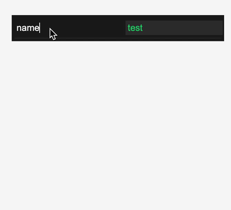

# snabbdom-property

snabbdom based property panel.



Primarily this is useful for building editors, particularly ones that edit css property strings. 


## usage

```javascript
import html     from 'https://cdn.jsdelivr.net/npm/snabby@2/snabby.js'
import property from 'https://cdn.jsdelivr.net/gh/mreinstein/snabbdom-property/property.js'


const model = {
    container: document.createElement('div'),
    property: property.init({
        properties: [
            {
                label: 'name',
                type: 'string',
                value: 'root'
            },
            {
                label: 'display',
                type: 'string',
                value: 'grid'
            }
        ]
    }
}

document.body.appendChild(model.container)


function appView (model, update) {
   return html`<main>
        <p>Here's a property panel:</p>
        ${property.view(model, update)}
    </main>`
}


function update () {
    const oldVnode = model.container
    const newVnode = appView(model, update)
    model.container = html.update(oldVnode, newVnode)
}


update()

```

## TODO

* move the css properties from example.html into the code
* enable setting other keyboard shortcuts for properties (right now hardcoded to `;`, `Enter`, `:`)
* actual css property validation
* support other property types besides strings
