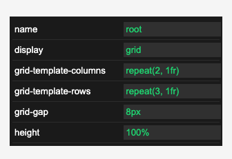

# snabbdom-property

snabbdom based property panel



## usage

```javascript
// TODO
```

## TODO

* wire up the dynamic behavior of the widget
* move the css properties from example.html into the code
